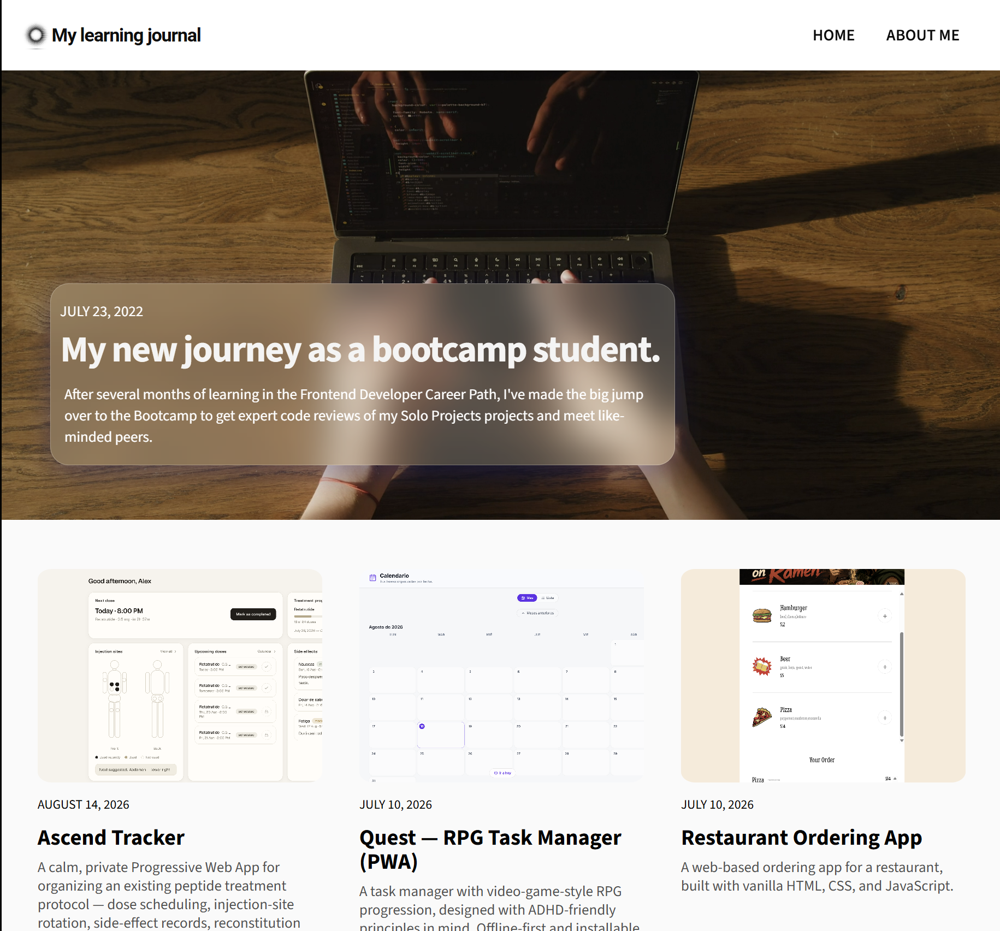

# My Learning Journal

A responsive personal blog built from scratch with HTML, CSS, and vanilla JavaScript — my Scrimba solo project.


<!-- Reemplaza con tu propio screenshot; súbelo a la carpeta images/ -->

🔗 **Live demo:** [https://johnnydev4.github.io/my-learning-journal-website/](https://johnnydev4.github.io/my-learning-journal-website/)
<!-- Si lo publicas con GitHub Pages, pega el link aquí -->

## About

My Learning Journal is a personal blog site — my Scrimba solo project. It features a homepage with a video hero and a dynamic post grid, an individual blog post page, and an About Me page, all fully responsive from mobile to desktop.

## Features

- 📱 Mobile-first responsive design (single breakpoint at 1080px)
- 🎥 Autoplaying video hero with a "liquid glass" text overlay and gradient title
- 🗂️ Dynamic blog grid rendered from a JS data array
- ➕ "View More" button that loads additional posts without a page reload
- 📄 Individual blog post page and About Me page
- 🎨 Custom typography with Google Fonts (Roboto, Source Sans 3)
- 🔗 Hover effects on navigation and links

## Tech Stack

- HTML5 (semantic markup)
- CSS3 (Flexbox, Grid, media queries, `rem`/`em` units, `backdrop-filter`, gradient text)
- JavaScript (ES Modules, array methods: `.map()`, `.slice()`)

## Project Structure

```
my-learning-journal/
├── index.html
├── hero.html
├── about.html
├── styles.css
├── index.js
├── hero.js
├── about.js
├── shared.js
├── data.js
├── images/
│   ├── hero.mp4
│   ├── hero.jpg
│   ├── card2.jpg
│   ├── card3.jpg
│   └── card4.jpg
└── README.md
```

## Running Locally

1. Clone the repo:
   ```bash
   git clone https://github.com/johnnydev4/My-learning-Journal-website.git
   ```
2. Open the folder in VS Code.
3. Right-click `index.html` → **Open with Live Server**.

## What I Learned

- Structuring a responsive layout mobile-first with a single desktop breakpoint
- Converting Figma design values (px, %) into `rem`/`em` CSS units
- Rendering dynamic content from a JavaScript data array using `.map()`
- Implementing "load more" functionality with `.slice()`
- Debugging CSS Grid with `grid-template-areas` and the cascade
- Sharing logic across multi-page vanilla JS projects with ES Modules
- Layering content over media (video/images) using `position` and `z-index`
- Creating glassmorphism (`backdrop-filter`) and gradient-text effects in CSS

## Roadmap

- [ ] Add hamburger menu for mobile navigation
- [ ] Add individual pages per blog post

## Author

**johnnydev4**
[GitHub](https://github.com/johnnydev4)
